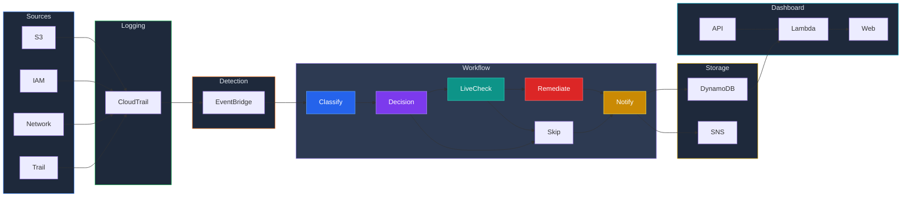

# AWS S3 Guardian

A comprehensive AWS security monitoring and auto-remediation platform. Detects threats across S3, IAM, Network, and CloudTrail — automatically fixes critical violations, stores all findings in DynamoDB, sends formatted email alerts, and displays everything on a real-time security dashboard.

## What It Does

```
Threat detected in your AWS account
        ↓
CloudTrail records the API call
        ↓
EventBridge matches one of 4 detection rules
        ↓
Step Functions orchestrates the response:
  1. Classify  → what category? what severity?
  2. Remediate → auto-fix if S3 or CloudTrail threat
  3. Notify    → store in DynamoDB + send email alert
        ↓
Dashboard shows all findings in real-time
```

## Architecture



## Threat Detection

| Category | Events Monitored | Severity | Auto-Fix |
|----------|-----------------|----------|----------|
| S3 Public Access | PutBucketAcl, PutBucketPolicy, DeletePublicAccessBlock | HIGH | Yes — blocks all public access |
| IAM Changes | CreateUser, DeleteUser, AttachUserPolicy, CreateAccessKey, etc. | HIGH/MEDIUM | No — alert only |
| Network Changes | AuthorizeSecurityGroupIngress, CreateSecurityGroup, etc. | HIGH | No — alert only |
| CloudTrail Tampering | StopLogging, DeleteTrail, UpdateTrail | CRITICAL | Yes — re-enables logging |

## Tech Stack

| Service | Purpose |
|---------|---------|
| AWS CloudTrail | API activity logging |
| AWS EventBridge | Event-driven threat detection (4 rules) |
| AWS Step Functions | Workflow orchestration (classify, remediate, notify) |
| AWS Lambda (Python) | 5 functions — classifier, remediator, notifier, API, legacy |
| AWS DynamoDB | Persistent storage for all findings |
| AWS SNS | Email alert notifications |
| AWS API Gateway | REST API for dashboard |
| AWS S3 | Monitored resource + dashboard hosting |
| AWS CloudWatch | Metrics, alarms, dashboard |
| Terraform | Infrastructure as Code |
| tfsec | Security scanning (37 checks passed) |

## Project Structure

```
aws-s3-guardian/
├── lambda/
│   └── lambda_function.py           # Legacy all-in-one Lambda (backup)
├── api/
│   └── lambda_function.py           # API Lambda — serves findings to dashboard
├── step-functions/
│   ├── classifier/
│   │   └── lambda_function.py       # Classifies events (category + severity)
│   ├── remediator/
│   │   └── lambda_function.py       # Auto-fixes S3 and CloudTrail violations
│   └── notifier/
│       └── lambda_function.py       # Stores in DynamoDB + sends formatted email
├── dashboard/
│   └── index.html                   # Security dashboard (S3 static hosted)
├── terraform/
│   ├── main.tf                      # AWS provider config
│   ├── variables.tf                 # Input variables
│   ├── s3.tf                        # S3 buckets + encryption + versioning
│   ├── cloudtrail.tf                # CloudTrail with log validation
│   ├── eventbridge.tf               # Event detection rules
│   ├── lambda.tf                    # Lambda functions + IAM (least privilege)
│   ├── sns.tf                       # SNS topic + email subscription
│   ├── cloudwatch.tf                # Dashboard + alarm + metric filter
│   └── outputs.tf                   # Output values
└── README.md
```

## Step Functions Workflow

```
Event arrives
    ↓
Classify Event (sentinel-classifier)
    ↓
┌─ S3_PUBLIC_ACCESS? ──────▶ Remediate (block public access) ──▶ Notify
├─ CLOUDTRAIL_TAMPERING? ──▶ Remediate (re-enable logging)  ──▶ Notify
└─ IAM / Network / Other ─▶ Notify (alert only, manual review)
```

Each step has error handling — if remediation fails, you still get notified. If classification fails, you still get an alert.

## API Endpoints

| Method | Endpoint | Returns |
|--------|----------|---------|
| GET | `/findings` | All security findings |
| GET | `/findings?severity=HIGH` | Filtered by severity |
| GET | `/findings?category=IAM_CHANGE` | Filtered by category |
| GET | `/stats` | Summary counts by severity, category, status |

## Deployment

### Prerequisites

- AWS account (Free Tier works)
- AWS CLI configured (`aws configure`)
- Terraform installed

### Deploy with Terraform

```bash
cd terraform
terraform init
terraform plan -var="alert_email=your@email.com"
terraform apply -var="alert_email=your@email.com"
```

### Destroy all resources

```bash
terraform destroy -var="alert_email=your@email.com"
```

## Security Features

- **Auto-remediation** — S3 public access blocked within seconds, CloudTrail re-enabled automatically
- **Least privilege IAM** — each Lambda has only the permissions it needs
- **S3 encryption** — all buckets encrypted with AWS KMS
- **S3 versioning** — enabled on all buckets
- **Public access blocked** — all storage buckets have public access block enabled
- **CloudTrail log validation** — ensures logs haven't been tampered with
- **Multi-region trail** — monitors API calls across all AWS regions
- **tfsec scanned** — 37 checks passed, 0 problems detected
- **Step Functions error handling** — retries and catch blocks on every step

## Sample Alert Email

```
========================================
   PROJECT SENTINEL - SECURITY ALERT
========================================

Category:    S3_PUBLIC_ACCESS
Severity:    HIGH
Event:       PutBucketAcl
Resource:    my-bucket
Time:        2026-03-30T10:00:00Z
Region:      us-east-1
Source IP:    203.0.113.50
Changed By:  arn:aws:iam::123456789:user/someone

----------------------------------------
WHAT HAPPENED:
Someone changed the bucket's ACL.
This could make the bucket PUBLIC.

----------------------------------------
AUTO-REMEDIATION:
Status: FIXED AUTOMATICALLY
Public access has been BLOCKED on this bucket.

========================================
```

## License

MIT
