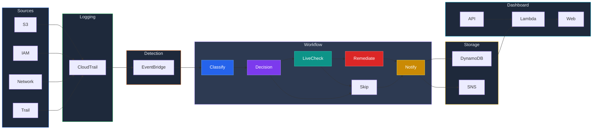

# AWS S3 Guardian

An automated security system for AWS that watches your cloud account 24/7, detects security threats in real-time, automatically fixes critical issues, and alerts you via email — all without any manual intervention.

## The Problem

Companies store sensitive data in AWS S3 buckets (cloud storage). Sometimes, someone accidentally — or intentionally — makes a bucket public, exposing files to the entire internet. This has caused major real-world data breaches:

- **Capital One (2019):** 100 million customer records exposed from a misconfigured S3 bucket
- **Twitch (2021):** Entire source code leaked from misconfigured cloud storage

Most teams don't find out until it's too late. Periodic scans and manual reviews can't catch real-time misconfigurations.

**AWS S3 Guardian solves this** — it detects the misconfiguration within minutes and fixes it automatically, before any damage is done.

## How It Works (Simple Version)

```
Someone does something suspicious in your AWS account
        ↓
The system records it (like a security camera)
        ↓
A detection rule matches the suspicious activity
        ↓
An automated workflow kicks in:
  1. Classify  → What happened? How serious is it?
  2. Verify    → Is it actually a problem? (checks live state)
  3. Fix       → Auto-fixes if critical (blocks public access)
  4. Record    → Stores the finding permanently
  5. Alert     → Sends you a detailed email
        ↓
You see everything on a live dashboard
```

## What It Monitors

The system doesn't just watch S3 — it monitors 4 categories of threats:

| Category | What It Catches | How Serious | Auto-Fix? |
|----------|----------------|-------------|-----------|
| **S3 Public Access** | Someone made a storage bucket public | HIGH | Yes — verifies the bucket is actually public, then blocks all public access |
| **IAM Changes** | Someone created new users, changed permissions, or created access keys | HIGH / MEDIUM | No — sends alert for manual review |
| **Network Changes** | Someone opened ports or modified firewall rules | HIGH | No — sends alert for manual review |
| **CloudTrail Tampering** | Someone tried to disable security logging (like turning off the cameras) | CRITICAL | Yes — immediately re-enables logging |

### Why Only Some Threats Are Auto-Fixed

- **S3 and CloudTrail** — safe to auto-fix. There's one clear correct action (block public access / re-enable logging).
- **IAM and Network** — risky to auto-fix. Deleting a user or closing a port could break running applications. A human should decide.

## Architecture



## How the Auto-Fix Works (Step by Step)

When the system detects an S3 bucket change, it doesn't blindly fix it. It follows a smart verification process:

```
Event detected: "Someone changed bucket permissions"
    ↓
Step 1: Classify
    → Category: S3_PUBLIC_ACCESS
    → Severity: HIGH
    ↓
Step 2: Live State Verification (3 checks)
    → Check 1: Is Public Access Block disabled?
    → Check 2: Does the Bucket Policy allow public access?
    → Check 3: Does the Bucket ACL grant access to everyone?
    ↓
Step 3: Decision
    → If actually public → FIX IT (block all public access)
    → If already secure → SKIP (no action needed, avoid false alarm)
    ↓
Step 4: Store finding in database + Send email alert
```

This **3-point verification** ensures the system only acts when there's a real problem — preventing false positives and unnecessary actions.

## Severity Levels

| Level | Meaning | Response |
|-------|---------|----------|
| **CRITICAL** | Someone disabled security logging — possible active attack | Auto-fixed immediately |
| **HIGH** | Significant security change (public bucket, new user, open port) | S3: Auto-fixed. Others: Email alert for review. |
| **MEDIUM** | Notable change (user deleted, policy removed) | Email alert |
| **LOW** | Minor or unknown event | Logged for review |

## Security Dashboard

A real-time web dashboard shows all security findings at a glance:

- **Summary cards** — total findings, critical, high, medium counts
- **Charts** — findings by category, remediation status
- **Filters** — filter by severity or category
- **Findings table** — every incident with time, category, event, severity, source IP, and status

## Sample Alert Email

When a threat is detected, you receive a clean, actionable email:

```
========================================
   PROJECT SENTINEL - SECURITY ALERT
========================================

Category:    S3_PUBLIC_ACCESS
Severity:    HIGH
Event:       PutBucketAcl
Resource:    my-bucket
Time:        2026-03-30T10:00:00Z
Region:      us-east-1
Source IP:    203.0.113.50
Changed By:  arn:aws:iam::123456789:user/someone

----------------------------------------
WHAT HAPPENED:
Someone changed the bucket's ACL.
This could make the bucket PUBLIC.

----------------------------------------
AUTO-REMEDIATION:
Status: FIXED AUTOMATICALLY
Findings:
- BlockPublicAcls is disabled
- IgnorePublicAcls is disabled
- ACL grants access to AllUsers (public)

Public access has been BLOCKED on this bucket.
========================================
```

## REST API

The system provides a REST API so any tool or dashboard can access the findings:

| Method | Endpoint | Returns |
|--------|----------|---------|
| GET | `/findings` | All security findings |
| GET | `/findings?severity=HIGH` | Filtered by severity |
| GET | `/findings?category=IAM_CHANGE` | Filtered by category |
| GET | `/stats` | Summary counts by severity, category, status |

## Tech Stack

| Service | What It Does In This Project |
|---------|------------------------------|
| **AWS CloudTrail** | Records every action in the AWS account (the security camera) |
| **AWS EventBridge** | Watches for suspicious events and triggers the response (the security guard) |
| **AWS Step Functions** | Orchestrates the classify → verify → fix → notify workflow (the response plan) |
| **AWS Lambda** | Runs the code for each step — 5 small functions, each with one job |
| **AWS DynamoDB** | Stores all findings permanently (the incident log) |
| **AWS SNS** | Sends email alerts (the notification system) |
| **AWS API Gateway** | Creates API endpoints for the dashboard to fetch data |
| **AWS S3** | The resource being protected + hosts the dashboard |
| **AWS CloudWatch** | Tracks metrics, triggers alarms if too many violations occur |
| **Terraform** | Defines the entire infrastructure as code — one command recreates everything |
| **tfsec** | Scans Terraform code for security issues (37 checks passed, 0 problems) |

## Project Structure

```
aws-s3-guardian/
├── lambda/
│   └── lambda_function.py           # Legacy all-in-one Lambda (backup)
├── api/
│   └── lambda_function.py           # API Lambda — serves findings to dashboard
├── step-functions/
│   ├── classifier/
│   │   └── lambda_function.py       # Classifies events (category + severity)
│   ├── remediator/
│   │   └── lambda_function.py       # Live state verification + auto-fixes
│   └── notifier/
│       └── lambda_function.py       # Stores in DynamoDB + sends email alert
├── dashboard/
│   └── index.html                   # Security dashboard (hosted on S3)
├── terraform/
│   ├── main.tf                      # AWS provider config
│   ├── variables.tf                 # Input variables
│   ├── s3.tf                        # S3 buckets + encryption + versioning
│   ├── cloudtrail.tf                # CloudTrail with log validation
│   ├── eventbridge.tf               # 4 event detection rules
│   ├── lambda.tf                    # Lambda functions + IAM (least privilege)
│   ├── sns.tf                       # SNS topic + email subscription
│   ├── cloudwatch.tf                # Dashboard + alarm + metric filter
│   └── outputs.tf                   # Output values
└── README.md
```

## Security Features

- **Live state verification** — before fixing anything, reads the bucket's actual configuration from 3 independent sources to confirm it's really public. Prevents false positives.
- **Auto-remediation** — S3 public access blocked within seconds, CloudTrail logging re-enabled automatically
- **Least privilege IAM** — each Lambda function has only the minimum permissions it needs
- **Encryption** — all S3 buckets encrypted with AWS KMS
- **Versioning** — enabled on all buckets to prevent data loss
- **Log validation** — CloudTrail logs are validated to ensure they haven't been tampered with
- **Multi-region monitoring** — captures API calls across all AWS regions
- **Error handling** — Step Functions retries failed steps and ensures you're always notified
- **Infrastructure as Code** — entire system defined in Terraform, scannable and reproducible
- **Security scanned** — tfsec verified with 37 checks passed, 0 problems detected

## Deployment

### Prerequisites

- AWS account (Free Tier works)
- AWS CLI configured (`aws configure`)
- Terraform installed

### Deploy

```bash
cd terraform
terraform init
terraform plan -var="alert_email=your@email.com"
terraform apply -var="alert_email=your@email.com"
```

### Destroy All Resources

```bash
terraform destroy -var="alert_email=your@email.com"
```

## License

MIT
